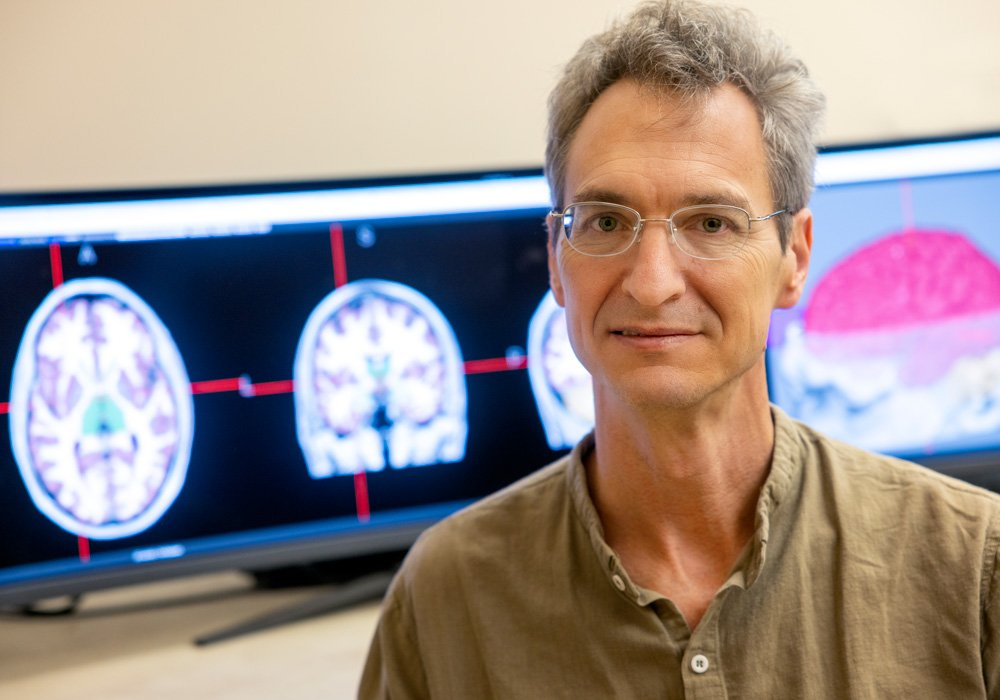
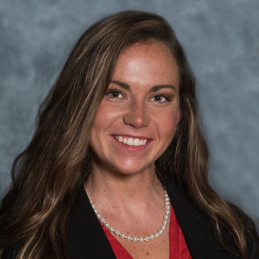
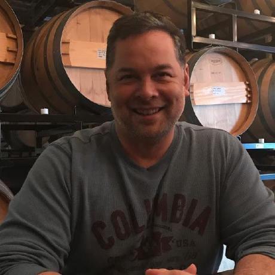

# About our team

## Team

 - Chris Rorden is the endowed chair of neuroimaging in the Department of Psychology at the University of South Carolina. He is also the director for the McCausland Center for Brain Imaging. He completed his PhD at the University of Cambridge under the supervision of Jon Driver. He completed post-doctoral work at with University College London and the MRC Cognition and Brain Sciences Unit. He has held faculty positions at the University of Nottingham, Georgia Institute of Technology and the University of South Carolina. His [CV](https://docs.google.com/document/d/1dwkSYHJ-RT3RxIX4nS4rpwUSben1oxW3/edit?usp=sharing&ouid=101539764775409240375&rtpof=true&sd=true) and [bibliography](https://www.ncbi.nlm.nih.gov/myncbi/christopher.rorden.1/bibliography/public/) are online.

 - Roger Newman-Norlund serves as the managing director for the McCausland Center for Brain Imaging. He graduated from Dartmouth College with a doctorate in Cognitive Neuroscience and spent five years as a postdoctoral scientist at the  Donders Institute for Brain, Behavior and Cognition. His [bibliography](https://www.ncbi.nlm.nih.gov/myncbi/1lCSfEEY11GQX/bibliography/public/) is online.

 - Makayla Gibson is completing a PhD with the team. Her work explores neuroimaging measures of brain health that predict resiliency to stroke. Her [bibliography](https://pubmed.ncbi.nlm.nih.gov/?term=Makayla+Gibson%5BAuthor%5D&sort=date) is online.

 - Chris Drake is a software developer, spearheading our team's [NiiVue](https://github.com/niivue/niivue) software. He has previously worked with Google, Microsoft and the US military.

## Topics

 - Attention and perception. Our senses flood the brain with an overwhelming amount of information – how do we select the relevant information? Clinical syndromes such as spatial neglect (where individuals ignore information on their left side) provide insight into how the brain achieves this.
 - Speech and language. Communication is invaluable for sharing information, planning and coordinating actions in a group. Human language is quantitatively and qualitatively a quantum leap from that seen in other species. Cognitive neuroscience is able to employ new techniques to understand language. This work will help reveal who we are, and may help people who have suffered profound communication difficulties following brain injury.

## Tools

 - Behavioral Tasks. Each of our studies requires us to develop sensitive behavioral tasks: for example in an fMRI study of time perception we will want to compare tasks where the person makes temporal judgments (e.g. which item appeared first) to perceptually identical tasks where the participant judges a different domain (for example the shape of the items). We have extensive skill in designing and implementing these tasks.
 - MRI scans use radio signals to take pictures of the brain. fMRI is a type of MRI scan that is is sensitive to oxygenation concentration, allowing us to infer brain function. Typically, we have people perform simple tasks in the scanner while we collect fMRI scans. We have used this technique to identify the brain areas involved with speech and perception. In addition, we have used fMRI to examine recovery from brain injury.
 - Lesion behavior mapping associates the location of brain injury with the resulting symptoms. For example, we use this technique to identify the brain injuries that result in speech impairment. We can also use this technique to identify the best targets for neurosurgery.
 - Transcranial Direct Current Stimulation. tDCS applies weak electrical currents to the scalp. It appears that tDCS can induce subtle changes in brain activity, with regions near the positive electrode showing slightly increased firing rates, whereas regions under the negative electrode show small decreases in firing rate. Curiously, these changes seem to persist for many minutes after the stimulation ends. Because this technique is very safe and inexpensive, this technique offers potential for the helping people recover from brain injury as well as revealing the function of the healthy brain. We have devised methods for double-blind testing of tDCS (where neither the participant nor the experimenter knows the type of stimulation used) to investigate this mysterious but promising technique.
 - TMS uses a brief magnetic pulse to stimulate parts of the brain near the TMS coil. The region of stimulation is relatively focused. By introducing TMS pulses while participants are conducting a task we can
 

