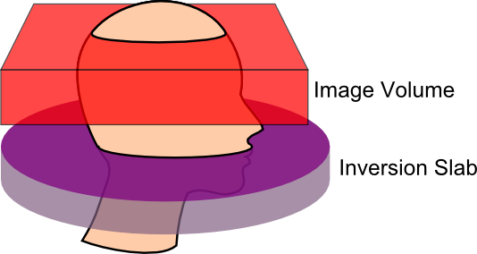

# Arterial Spin Labeling (ASL)

Arterial Spin Labeling (ASL) is a Magnetic Resonance Imaging (MRI) technique for measuring blood flow. Whereas conventional Perfusion Weighted Imaging (PWI) uses an external agent like Gadolinium (Gd) to tag blood, ASL directly tags the blood entering the brain. Conventional PWI has high signal to noise, but we tend to only track the perfusion of a single bolus (e.g. Gd is injected once into the arm, and we measure the latency and amount of this agent reaching different parts of the brain). In contrast, with ASL we have low signal to noise, but can easily acquire and compare hundreds of images. The rest of this page focuses on ASL, for more details on conventional PWI, please visit my [PWI page](../pwi/index.md).

ASL can be used to measure make quantitative measures of perfusion, such as the relative cerebral blood flow (rCBF). In addition, ASL scans can be used to infer brain function, similar to T2\*-weighted fMRI. In general, ASL fMRI has slower acquisition, reduced field of view, and worse spatial distortions relative to T2\* fMRI. However, it does provide a more direct measure of blood flow that may be helpful in cases where the canonical hemodynamic response has been disrupted. In any case, FSL makes it pretty easy to analyses ASL fMRI in a manner that is very similar to T2\* fMRI.Therefore, the rest of this web page describes the analysis of quantitative ASL data.

There are many different types of ASL sequences. Your sequences will be limited by the type of scanner you have, as well as the sequence licenses you have available. Several major variations are CASL (continuous ASL), PASL (pulsed ASL) and pCASL (pseudo-Continuous ASL). At the MCBI we have the official Siemens PASL sequence (PICORE Q2T) and the pCASL from JJ Wang and his team. The Siemens sequence is elegant, as it automatically creates a rCBF map. However, we tend to prefer the pCASL sequence for our studies.

A crucial step when acquiring ASL data is to set the correct post-label delay time. This is the time between when the blood is tagged in the neck and when the image of the brain is acquired. If the delay is too short, the blood will not have time to transit into the image, and if it is too long it will already have washed out of the image. This is especially important, as we will acquire pairs of images: one labelled and one unlabelled. One could imaging that with a very brief post-label delay and a short time between volumes (TR), the tagged blood might not get to the head in time for the ‘labelled’ image, but be clearly present during the ‘unlabelled’ image acquisition. I strongly suggest consulting the people who developed your sequence to get their suggestions for post-label delay times. For the pCASL sequence we have, [Ze Wang](https://www.cfn.upenn.edu/~zewang/ASLtbx.php) has suggested a delay time in the range of 700-1000ms for healthy children and young adults, while for older individuals (65 or older) he suggests 1200-1500ms, finally for stroke patients or patients with vascular diseases he notes that 1800ms might be required. In any case, this selection should be standardized for a single study. For example, a shorter delay may be required for a study of stroke that hopes to examine both the intact and injured hemisphere. However, if you plan to acquire images from special populations (e.g. people with strokes) you may want to consult your physicist. As you adjust the delay time, the minimum TR is also influenced. Ze Wang suggests that your actual TR should always be at least 100ms longer than the minimum TR since the labeling pulses induce Magnetization Transfer (MT) effects to the brain regions to be imaged, so before the spins go back to the steady state, they are suppressed to some extent by the labeling pulses. Longer TRs provide more signal (more time for spins to relax), though at the cost of fewer acquisitions (and more difficulty temporally interpolating data for fMRI-like task based paradigms). In general, a TR of 3500ms seems appropriate (unless your population requires a very long delay time). Another thing you should bear in mind with the CfN pCASL sequence is the bandwidth (indeed, bandwidth is an important decision for echo-planar imaging \[EPI\] protocols). With regards to the CfN pCASL sequence, Ze Wang notes that high bandwidths can lead to severe eddy currents leading to phase accumulation and a N/2 ghost artifact. Performance varies between scanners, but he suggests that 2232 to 2694 Hz/pixel should be appropriate for most Siemens Trios (you should also check that images from your scanner do not show aliasing artifacts, if you see artifacts then you should collect images without iPAT \[as this can also cause artifacts\] and iteratively take images while decreasing the bandwidth until the artifacts go away). You will also want to specify your labeling time, for example if your protocol PDF reports 80 blocks, the Labeltime = 80\*0.0185, since the CFN pCASL RF block duration is ALWAYS 0.0185s (20 RF pulses with gaps). For our protocol, we use 80 RF blocks, a bandwidth of 2442 Hz/px, and acquire 17 slices. With these settings the minimum TR is 2090ms plus the delay time (so since slicetime=\[minTR-labelingtime-delaytime\]/#slices, we can compute that our Slicetime is 36.35294118ms). For example, with a 1200ms post label delay the minimum TR is 3290ms, and we typically acquire with a TR of 3500ms.

If your data is in DICOM format, or if your ASL data is 3D (one file per timepoint, instead of a single file with all time points), you can convert them with [dcm2niix](https://www.nitrc.org/plugins/mwiki/index.php/dcm2nii:MainPage).

## Links and References

 - Ashburner J, Friston KJ. ([2005](https://pubmed.ncbi.nlm.nih.gov/15955494)) Unified segmentation. Neuroimage. 26:839-51.
 - Wu WC, Fernández-Seara M, Detre JA, Wehrli FW, Wang J. ([2007](https://pubmed.ncbi.nlm.nih.gov/17969096)) A theoretical and experimental investigation of the tagging efficiency of pseudocontinuous arterial spin labeling. Magn Reson Med.58:1020-7.
 - Wang J, Licht DJ, Jahng GH, Liu CS, Rubin JT, Haselgrove J, Zimmerman RA, Detre JA. ([2003](https://pubmed.ncbi.nlm.nih.gov/14508776)) Pediatric perfusion imaging using pulsed arterial spin labeling. J Magn Reson Imaging. 18:404-13.
 - Wang Z, Aguirre GK, Rao H, Wang J, Fernández-Seara MA, Childress AR, Detre JA. ([2008](https://pubmed.ncbi.nlm.nih.gov/17826940)) Empirical optimization of ASL data analysis using an ASL data processing toolbox: ASLtbx. Magn Reson Imaging. 26:261-9.
 - The [ASLtbx](https://www.cfn.upenn.edu/~zewang/ASLtbx.php) webpage, [journal article](https://pubmed.ncbi.nlm.nih.gov/17826940).

