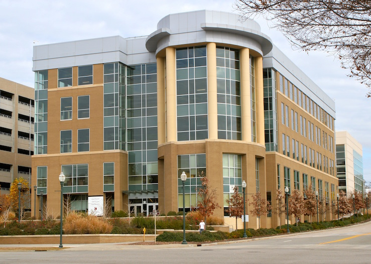

# Directions

Dr. Rorden’s Neuropsychology Labs at University of South Carolina
examine the behavioral difficulties people experience after brain
injury. We are located in the city of Columbia, the state capitol of
South Carolina. We are located in the
[Innovista](https://sc.edu/about/offices_and_divisions/economic_engagement/facilities/index.php),
a short walk from the restaurants of the
[Vista](https://www.vistacolumbia.com/), the [state
house](https://en.wikipedia.org/wiki/South_Carolina_State_House) and the
historic [University
Horseshoe](https://sc.edu/about/our_history/horseshoe_history/index.php).

## Brain Stimulation Lab, Computer Cluster and Primary Offices

 - [Discovery I
   Building](https://sc.edu/visit/map/?id=744&amp;tbh=1&amp;sbh=1#!col/Discovery 1 Building:223310:0:1:1?mc/33.995063013614065,-81.03521525859834?z/18)
 - 915 Greene Street
 - Columbia, SC 29208
 - 803 404 2573

## [McCausland Center for Brain Imaging](https://sc.edu/study/colleges_schools/artsandsciences/centers_and_institutes/mccausland_center/index.php)

 - [3T Magnetic Resonance
   Imaging](https://www.sc.edu/study/colleges_schools/artsandsciences/centers_and_institutes/mccausland_center/directions/index.php)
 - Palmetto Health Richland
 - Medical Park Road
 - Columbia, SC 29203
