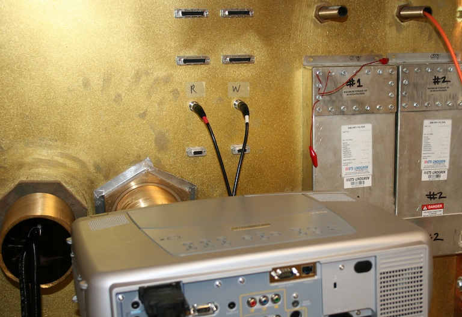
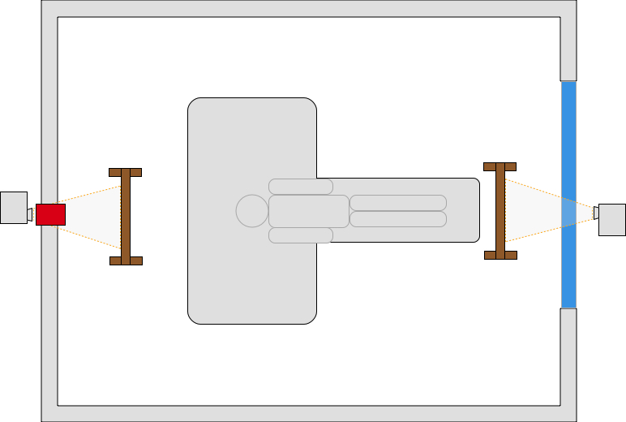
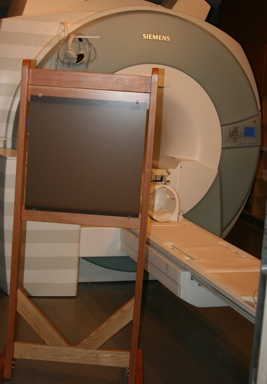
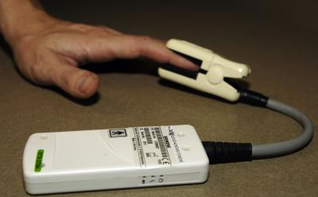
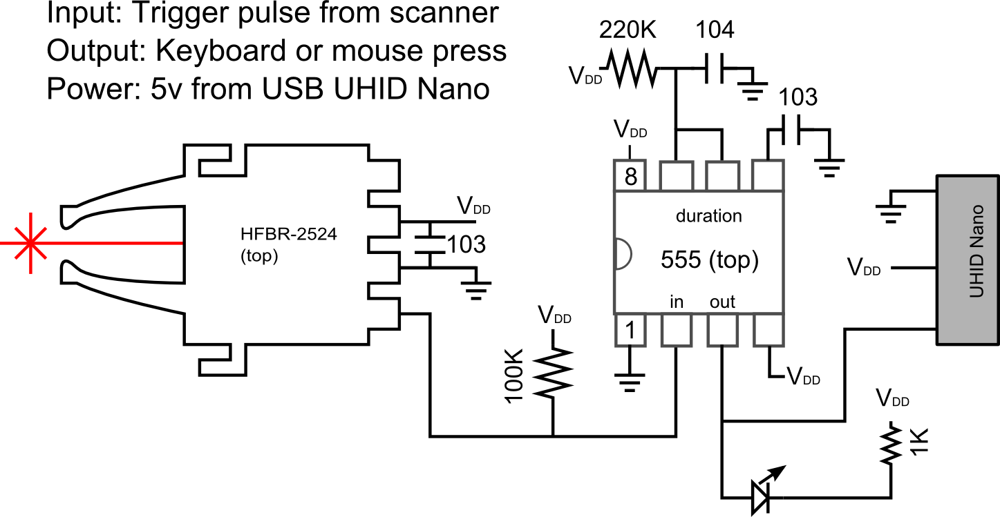

# DIY fMRI

This web site is designed for people who are setting up a Magnetic Resonance Imaging (MRI) scanner for functional imaging (fMRI). The basic idea of fMRI is to rapidly acquire T2\*-weighted images of the brain while the participant performs a cognitive task. We can then analyze the data to determine which brain regions are changing their signal in response to the behavioral task. To do this, we typically need a way to present task (usually a visual task via a computer screen or an auditory task via headphones) while we collect behavioral data (e.g. button presses). We also need a way to synchronize the scans with the behavioral task.

Since MRI is an inherently expensive tool, most new centers should certainly budget for professional MRI-compatible solutions for stimuli presentation, behavioral recording and scan synchronization. I try to describe several of the professional options on this web page. However, it should be noted that the costs of MRI is largely fixed, and many scientists hope to utilize a clinical system when it is not required for clinical duties. For this audience, I describe inexpensive methods to solve these problems. However, I wish to stress that the implementation of these techniques must be done carefully, and I take no responsibility for any issues that might arise using the methods described here.

Aspects of MRI make it inherently unsuitable for many off-the-shelf electronic devices. Issues include a strong constant (static) magnetic field, rapid switching of magnetic fields (gradients, that can induce electrical signals), radio frequency (RF) transmission and RF acquisition.

## Setup

I really urge new fMRI users to get to know their MRI service engineers and application specialists. These individuals are very knowledgable, and in my experience they are pivotal to getting the best out of your scanner. Further, it is worth giving them a heads up if you are going to add new hardware. Specifically, they can help ensure you have the correct software licenses (most users will need a Echo Planar Imaging \[EPI\] license, which is generally common and pre-installed). Second, you will want to have an idea of where the EPI trigger hardware is located – for Siemens scanners you will want an optical cable routed from the equipment room to the location where your behavioral computer is located (last I checked, the Philips MRI systems have an electrical connector at the console). You will also want the service engineer to help you enable scanner to generate the EPI trigger signals (on Siemens scanners, this is done once in the service software, whereas for Philips scanners this is done on the protocol scan card).

If you are establishing a new MRI center, it is critical to establish the location and configuration of your penetration panel(s). A penetration panel allows cables and light to enter in the scanner bay without introducing RF artifacts. The image on the right shows a typical research fMRI penetration panel with a computer projector, optical cables (PST response glove cables are black, scanner trigger pulse is orange), and some metal electrical cables (plugged into BNC jacks). Tubes (wave guides) that run through the penetration panel need to be tuned for the frequencies used by your scanner. The larger the bore of the wave guide, the longer (and heavier) the guide. It is easy to send light (e.g. a computer projector beam) or optical cables through a wave guide, but you need to be very careful putting any wire cables through a wave guide: the cables need to be shielded, the signals should not be at the frequency used by the scanner, the shield should be grounded, and typically the signals should be run through an RF filter (the photo shows some filters on the DB9 and DB25 jacks). It is generally a good idea to have wave guides professionally installed – if they are poorly mounted they can introduce RF artifacts into all your scans. For most clinical setups, there are usually a few unused waveguides you can exploit, but you will want to have a careful discussion with your service engineer to ensure that these wave guides are not intended for some future hardware.

You will want to carefully select the sequences used for your fMRI study. Generally, it is a good idea to carefully consult with a MRI physicist, and see examine the sequences used by other centers that have similar hardware. Here are examples of our teams evaluation of [Diffusion-weighted imaging (DWI)](https://osf.io/brvak/) and [Arterial Spin Labeling (ASL)](https://osf.io/td4bx/) .

## Visual stimuli

Computer screens are the typical way for presenting fMRI tasks. This allows you to present experiments written in EPrime, Presentation, Cogent, or your favorite programming language. There are basically four options here:

 - The least expensive solution is to place a computer projector at the foot of the MRI scanner. With this method, you shine through the console window (shown in blue in the diagram). Since the projector is outside the faraday cage, you can use an ordinary projector. There are two small disadvantages to this method. First, typical console glass includes a metal mesh to block radio signals, and this degrades the image a bit. The other problem is that this limits your view of the participant from the console – so it is harder to see if the participant is squirming or otherwise uncomfortable.
 - You could put a computer projector beyond the head of the participant. Typically, the projector is located outside the scanner and shines through a wave guide (shown in red in the diagram). This does require a very large wave guide and a projector with a long-throw lens. An alternative of this method is to get a MRI compatible projector that is placed inside the magnet hall (so a large wave guide is not required), for example professional solutions by [Avotec](https://avotecinc.com/collections/all) and [PST](https://pstnet.com).
 - [Nordic NeuroLab](https://nordicneurolab.com) and [Cambridge Research Systems](https://www.crsltd.com) sell MRI compatible LCD monitors that could be placed at the head or foot of the participant.
 - You could purchase an MRI compatible LCD display in the form of [goggles](http://www.mrivideo.com/visuastimdigital.php) or a [panel](https://www.avotecinc.com) that mounts directly to the headcoil. This does require extra cables running into the scanner, and many of the solutions have limited resolution.

The first three methods require a mirror mounted on the head coil. Your scanner manufacturer should provide you with one of these (seen on the headcoil in the picture on the right). The first two methods require a back projection screen. The image on the right shows the professional screen we use. However, a low budget version can be made using plastic (PVC) pipe from you local plumbing store and a large sheet of drafting mylar.

## Auditory stimuli

 - fMRI acquisition generates loud sounds (as we need to drive the gradients). This makes auditory presentation difficult. Most scanners include air conduction head phones that can be used to present sounds. There are also professional systems that provide better fidelity including [Avotec audio](https://www.avotecinc.com) and [Resonance Technologies](http://www.mrivideo.com/visuastimdigital.php) . In any case, one option is to ask the participant to wear ear plugs as well as the headphones. That way, the scanner sounds are attenuated by both the ear plugs and the headphones while the sounds you are intentionally presenting are only attenuated by the ear plugs. If you follow this approach, be aware that most ear plugs selectively reduce higher frequencies which alters sounds – in the past I have used [high fidelity Etymotic ETY•Plugs](https://www.etymotic.com) earplugs that have a more balanced range of attenuation.
 - In any case, for studies with auditory stimuli you may want to consider sparse acquisition, where one inserts a few seconds pause after each volume of data is acquired. This means that there is a few seconds where the scanner is silent and auditory stimuli can be presented during this interval. Since the hemodynamic response is sluggish, the noisy acquisition captures brain response from the quiet period.

## Tactile stimuli

You can present tactile stimuli by using air puffs, piezoelectric ceramics, or electrical currents. However, each of these techniques has its own challenges and are used less often in everyday research. Therefore, I do not discuss these in detail here.

## Eye Tracking

The human eye has poor acuity away from fixation, so you can learn a lot by observing where someone is looking. There are no simple, inexpensive solutions, but there are numerous professional solutions that you can find with a web search for the terms “fmri eye tracker”. In my experience, there is a huge variability in the professional products available. Before purchasing a system I strongly advise visiting a research site that has the intended system installed and seeing it in operation by scientists (rather than sales reps).
## Recording button responses

 - We typically ask our participants to make responses during our fMRI session. This ensures that the participant is performing the task, and even allows us to assess performance related brain activity (e.g. what brain activity is associated with correct/incorrect, fast/slow, etc. responses). There are a couple of solutions. These will typically require a wave guide as described in the setup section.
 - Electrically wired approaches provide the least expensive solution. One option is to use a plastic [USB keyboard](https://pubmed.ncbi.nlm.nih.gov/15734367) , a shielded MRI compatible USB cable, a pi-filter tuned to your scanners’ Lamour frequency (and grounded to the Faraday cage). This is a very simple solution, though note that the article demonstrates that some keyboards are better than others. In my experience the described keyboard has a pretty poor feel, so this is a workable but not ideal solution. One can purchase or create electrical devices with minimal ferrous metal using either USB signals or better yet a low-frequency electrical signal. These provide a simple solution to the problem, though care needs to be taken in selecting the buttons, cables, RF filters, and other components. A nice professional example of this approach is the devices provided by [Hybrid Mojo](http://www.hybridmojo.com/) . One potential problem with these electrical methods is that scanning could cause some of the long wires to heat, which could result in thermal injury. Be warned that radio frequency pulses could lead to heating, and therefore hardware that works fine in one sequence (e.g. a simple T2\* fMRI sequence) might exhibit extreme heating in another sequence (e.g., an arterial spin-labeling sequence). One should be careful to ensure that the cables have a straight run, and are not looped.
 - Wireless button response systems provide an elegant solution that does not require cumbersome wires. The Siemens Bluetooth physiological recording devices (described below) demonstrate the feasibility of this concept – emitting radio signals at a very different frequency than those used for MRI acquisition. However, the components would need to be carefully selected, shielded and tested.
 - Fiber optic cables do not interfere with the radio signals used in MRI scanning, and therefore provide clear advantages over electrical methods. However, in my experience these systems also have poor connectors and poor button reliability, so if you go this route you should ensure a good warranty. [Hollinger et al. (2007)](https://www.concordia.ca/artsci/psychology/research/penhune-lab/publications.html) describe this method. Professional solutions include [Current Designs](https://www.curdes.com/) , [PST Celeritas](https://www.pstnet.com) , [NAtA](https://natatech.com) , [Cedrus](https://www.cedrus.com/lumina/) , [NordicNeuroLab](https://nordicneurolab.com/) , [Resonance Technologies devices](http://www.mrivideo.com/visuastimdigital.php) , and [VPixx](https://vpixx.com). You can also build your own [optical response buttons](https://github.com/neurolabusc/mri_buttons), though it is difficult to achieve the desired tactile feedback.

## Recording physiological data

 - It is often useful to collect physiological measures for features such as heart rate or respiration. These data are often used as nuisance regressors (since [physiological noise can interfere with our ability to detect cognitive responses](https://github.com/neurolabusc/Part)). Alternatively, these may be our prime measures of interest (e.g. heart rate variability may reveal something about the emotional state of the participant).
 - Many scanner manufacturers provide devices for measuring pulse and heart rate. For example, Siemens provides wireless (bluetooth) heart rate (shown in photos on the right) and respiration sensors that record at ~50Hz. Philips includes heart rate and respiration with recording of ~400Hz (though their data logging makes these files much harder to synchronizing with scanner acquisition). However, it should be noted that the scanner manufacturers are developing these tools primarily for data acquisition (e.g. triggering the MRI at a specific phase in the cardiac or respiration cycle), and therefore these devices may not be ideal for all situations (for example measuring blood oxygenation, SpO2). Other devices do exist that can help in these situations. For example, [Mark Wall](https://computingforpsychologists.wordpress.com/) reports that the [PowerLab ADC](https://www.adinstruments.com/products/powerlab-daq-hardware) and [CED1401](https://www.adinstruments.com/products/powerlab-daq-hardware) can be used for MRI acquisition.

## Scanner Synchronization

One critical requirement is knowing the timing between behavioral events (when did the participant see/hear/do something) and fMRI acquisition. We typically want our behavioral experiment to start precisely when the scanner begins acquiring data. This turns out to be somewhat tricky, as the scanner initializes most scans with a shimming sequence (that can take a variable time) and also discards the first few scans (as these have more T1-effects). Therefore, starting your scanner when you hear the auditory sounds of the scanner or when you detect RF signals is not sufficient. Fortunately, modern scanners can be set to generate trigger signals at the beginning of each EPI volume (as described in the Setup section). The trick is turning these very brief (nano-second) signals into longer signals that most computer inputs can detect (milliseconds). Further, Siemens scanners generate optical signals, which we need to convert to electrical signals.  

Several professional behavioral input devices include a trigger detector. For example, the [Current Designs](https://www.curdes.com/) hardware includes an optical detector, while the [PST Fiber Optic Button Response system](https://pstnet.com/products/celeritas/) includes an electrical trigger detector (via a BNC connector).

You can also build your own trigger pulse detector. The photograph and schematics on the right show a very simple device using the ubiquitous TLC555 timer as a monostable multivibrator and the versatile [U-HID nano](https://www.ultimarc.com/control-interfaces/u-hid-en/) . The photo shows the standard Siemens compatible optical connector on the left, this board contains a small light that is red when the power is on, but briefly flashes off when a scan pulse is detected. The circuit is socketed onto a UHID nano (right side) that supplies power and transmits responses to the computer via the USB cable. This circuit is easy to build on a bread board or solder onto a prolect board, but if you are interested you can also contact me for Gerber files that you can have fabricated by vendors such as the terrific [OSH Park](https://oshpark.com/) (USA) or [Fritzing](https://fritzing.org/) (Europe, they also provide excellent software for designing your own boards). I like the UHID devices because you can program them to emulate many different devices (mouse buttons, keyboard presses, gamepad presses) and once this configuration is programmed any computer will see it as the designated response. Whereas the professional devices have a fixed mapping (e.g. for PST, a trigger pulse emulates the ‘^’ keypress), the UHID can be any device. Personally, I prefer to emulate devices such as gamepads that do not fill up the keyboard buffer or interfere with any programs that may be running. More details regarding synchronizing with your scanner can be found at my [data logging](https://people.cas.sc.edu/rorden/ttlrecord/home.html) page.

## Relevant Links

 - Our [StimSync](https://github.com/neurolabusc/StimSync) web page describes how to use the Teensy with experiments. For example, a Teensy could be used instead of the Nano.
 - I have an old page on controlling a experiments with [legacy serial and parallel ports](https://people.cas.sc.edu/rorden/io/index.html) . Unfortunately, it is harder to get computers with those ports.
