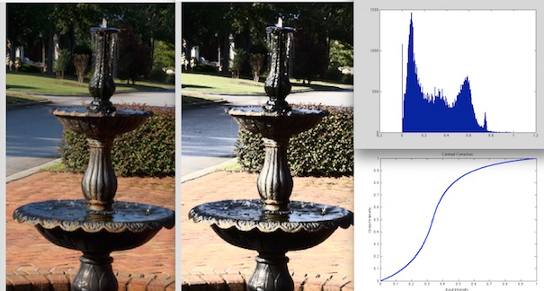

Bitmap Contrast
=======================================

 -  This page describes how Matlab can be used to tune the appearance of photographs. This page is really for scientists – most image editing applications include great tools for adjusting these values (free options include IrfanView with its great ‘Batch Conversion’, and for OSX Apple includes Preview with a nice Adjust Color feature; there are many professional options including the `curves tool for Pixelmator <http://www.pxm-tuts.com/tutorials/tools/pixelmator-curves/>`_).

This image shows the results of this script: the leftmost image shows the original source image, with the subsequent images showing the effect of 0.85 linear contrast, 0.85 nonlinear contrast, and 0.15 linear contrast.

Requirements and Usage
-------------------------------------------

You can download the Matlab code named `bmp_contrast.m from my GitHub repository <https://github.com/neurolabusc/spmScripts>`_, you will also need a copy of Matlab and images in formats that Matlab can read (png, jpeg, tiff, etc). This code does **NOT**  require a license for the Matlab Image Processing Toolbox. Launch Matlab and make sure the bmp_contrast.m file is in your current directory. You can then simply type bmp_contrast from the Matlab command line – a dialog will allow you to choose the images you will want to manipulate and then a dialog window will ask you to provide three values:

 - Desired contrast from 0..1. A value near 0.5 means no change, smaller values lead to reduced contrast and larger values lead to increased contrast. The default is 0.8 leading to an image with substantially more contrast
 - Desired brightness from 0..1. A value near 0.5 will have mid-gray brightness, lower values will lead to dark output, while higher values lead to brighter output. You can also specify a negative value (e.g. -1): in this case the brightness is adjusted based on the input image so that the output will have similar brightness. The default is -1 (automatic brightness control).
 - Linear (1) or non-linear (0) transforms. Increasing contrast with linear transforms tends to clip the image intensity (as shown in the picture where the Linear transform with a 0.85 contrast leads to a ‘blown out’ image), where the nonlinear transform has a more gradual influence near the brightest and darkest extremes. In other words, we can preserve a lot of the edges by applying a non-linear transform. On the other hand, when we reduce contrast (contrast values less than 0.5) it is generally a good idea to use a linear transform (most JPEG images store dark portions with low precision, so we do not want to exaggerate the dark colors.

The software also includes a file named bmp_contrast_batch which allows you to apply hundreds of contrast/brightness levels to hundreds of input images with just a few clicks – and the output images are given sensible file names.

Technical Notes
-------------------------------------------

 -  Here is what this software does.
	 - The image is loaded.
	 - Image values are scaled to range from 0..1 (using 64-bit double precision values) regardless of whether the original image was stored with 8-bit (0..256) or 16-bit (0..65535) precision.
	 - If it is a color image, the original red, green, blue color components are converted to YUV. This allows us to transform the intensity (Y) while preserving the relative color. This step is skipped for grayscale images (as these natively only store intensity).
	 - If you requested brightness autobalance, the `log-average luminance <http://www.cs.utah.edu/%7Ereinhard/cdrom/tonemap.pdf>`_ is computed as an estimate for the global image brightness. The software than tests 256 different bias values with your selected gain value to identify the bias value that best maintains the orginal luminance.
	 - An intensity transform is generated based on your contrast and brightness preferences. This is then applied to the intensity values of your image.
	 - For color images, the YUV data is converted back to red, green and blue channels.
	 - If requested, histograms of the images before and after transform as well as a graph of the transform function are displayed.
	 - The newly transformed image is saved to disk.

Links
-------------------------------------------

 - `John Burkardt <http://people.sc.fsu.edu/%7Ejburkardt/m_src/image_contrast/image_contrast.html>`_ provides Matlab code for adaptively adjusting local edge contrast. In other words, Burkardt scripts are blurring and sharpening the images – I would personally use a Gaussian blur and Unsharp Mask for those effects. Note this is very different from my code that adjusts the global contrast.
 - The Matlab Image Processing Toolbox (which requires a separate license from Matlab) can be used to tune `image contrat <http://www.mathworks.com/products/image/examples.html?file=/products/demos/shipping/images/ipexcontrast.html>`_.
 - My code implements `Christophe Schlick’s bias and gain algorithm <http://dept-info.labri.fr/%7Eschlick/DOC/gem2.html>`_ for the nonlinear transforms.
 - The book `Advanced High Dynamic Range Imaging: Theory and Practice <http://www.amazon.com/Advanced-High-Dynamic-Range-Imaging/dp/1568817193>`_ is a great reference for image processing. The authors also have a `website with Matlab code from the book <http://www.banterle.com/hdrbook/index.php>`_.
