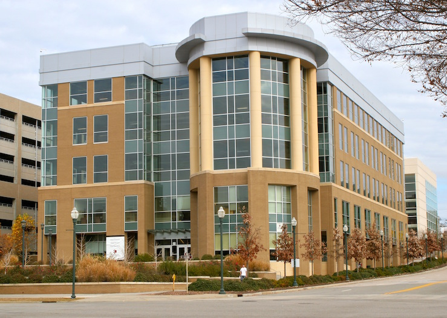

Directions
==============

.. _my_directions:

Dr. Rorden’s Neuropsychology Labs at University of South Carolina examine the behavioral difficulties people experience after brain injury. We are located in the city of Columbia, the state capitol of South Carolina. We are located in the `Innovista <https://www.sc.edu/research/business_partnership_opportunities/>`_, a short walk from the restaurants of the `Vista <https://www.vistacolumbia.com/>`_, the `state house <https://en.wikipedia.org/wiki/South_Carolina_State_House>`_ and the historic `University Horseshoe <https://sc.edu/about/our_history/horseshoe_history/index.php>`_.

Brain Stimulation Lab, Computer Cluster and Primary Offices 
------------------------------------------------------------------------------------------------------------

 - `Discovery I Building <https://www.sc.edu/visit/map/?x=1001&amp;y=556&amp;number=230>`_
 - 915 Greene Street
 - Columbia, SC 29208
 - 803 404 2573

`McCausland Center for Brain Imaging <https://www.mccauslandcenter.sc.edu/>`_
------------------------------------------------------------------------------------------------------------

 - `3T Magnetic Resonance Imaging <https://www.palmettohealth.org/locations-directions>`_
 - Palmetto Health Richland
 - Medical Park Road
 - Columbia, SC 29203
