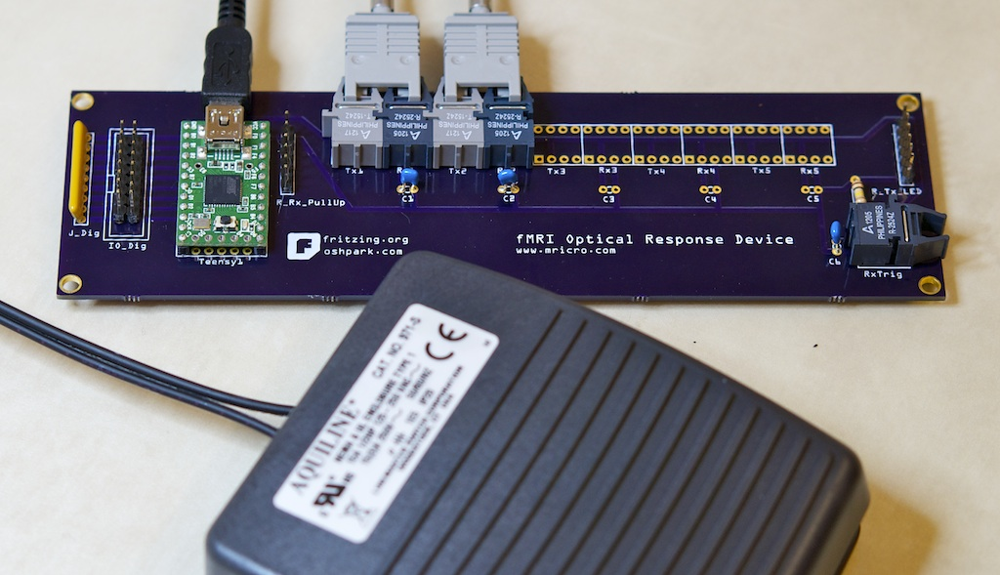
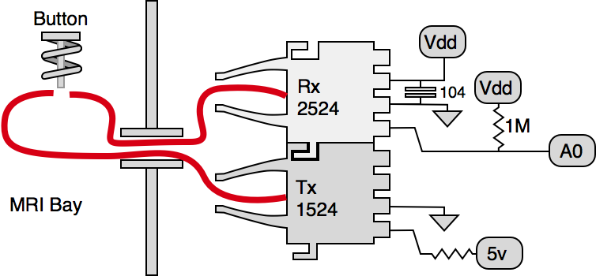

MRI buttons
==========================================

.. _my_fmri_resp:

During functional magnetic brain imaging we ask participants to conduct cognitive tasks while we scan there brain. The scans are tuned to be sensitive to changes in oxygen levels, so we can infer
how the brain works. These studies commonly require us to record the participants responses, to ensure they were completing the task and also to allow us to see if different responses are predicted by different patterns f brain activity – for example what areas of the brain are more active when you remember seeing an item previously versus similar stimuli that you do not remember having seen before? My :ref:`DIY fMRI page <my_diy_fmri>` describes a number of professional and home made solutions for collecting button presses in the scanner. As that page notes, there are optical, wireless and wired solutions for this problem. This web page describes an optical-based solution I have built myself. In general, I think most users would be well served with the professional solutions (my work has employed several of these). However, the product I describe here is useful if you have a very tight budget or if you want to build custom input devices (for example I wanted to use foot switches).

Hardware
-------------------------------------------

To build this hardware, please download the Fritzing plans and Teensy software. You can use Fritzing to generate Gerber files that can be sent for fabrication. This is a very new project, and be aware that these plans differ slightly from the boards I have already built. The new plans should work, but please contact me if you have any issues.
schematic.png

My setup allows up to five response buttons – for each button you need to purchase a Avago HFBR-1524 optical transmitter and a Avago HFBR-2524 optical receiver (about $22 a pair). You will also need a Teensy 2.0 ($19), a SIP 5 resistor (6 pin) network of 100 Ohm resistors, a SIP 5 resistor (6 pin) network 330 Ohm resistors, a SIP 5 resistor (6 pin) network of 1M Ohm resistors. For each button, you will need a button and spring assmbly (described below) and a length of VersaLink duplex cable – I purchased a 20-meter patch cable that I cut in half to support two buttons with 10m of length each. You will require one 0.1uF (104) capacitor for each button. You will also need either a large breadboard or a custom printed circuit board (I use OSH Park, but there are many vendors – for example Fritzing in Europe. Y

To build the device on the PCB, put the network resistors into the sockets – note that one of the pins connects to ground and this is marked on the resistor with a dot and on the circuit board with a white line. If you put in the network resistors backwards the device will not work. Put the 1OO Ohm resistor in the R_Tx_LED socket – these control the power output of the 1524 transmitters. Put the 330 Ohm resistor in the J_Dig socket – these allow you to add optional light emitting diodes that will illuminate when a key is pressed. Put the 1M Ohm resistor in the R_Rx_Pullup socket – these act as pullup resistors for the 2524 receivers. Put the Teensy 2.0 into the Teensy socket. Put each 1524 transmitter into the Tx socket, and each 2524 into the Rx socket. If you only need two buttons fill the sockets with lower numbers (e.g. Tx1, Tx2, Rx1, Rx2). For each receiver, place a 0.1uF (104) decoupling capacitor into the corresponding C1 socket. Now you can plug in your Teensy and upload the software to the Teensy – once this program has been flashed onto the Teensy it will appear as a USB keyboard to any computer you plug it in to. The example.c software I provide is set to support two keys (nKey_A 2), and emulate presses of the ‘a’ and ‘b’ keys of a keyboard ({KEY_A, KEY_B}) – simply change these values and recompile if you want to support more buttons or different mappings.

The hardest part of this project is making the non-metal buttons. You will want the button to act as a Guillotine that blocks light from one side of the optical fiber to the other. For foot switches, I adapted the Linemaster 971, replacing the metal spring with a plastic spring, and replacing the mechanical button with a plastic plunger. This works fine – it does not provide a tactile click, but is suitable for a foot pedal. I would be happy to hear and share other creative solutions
