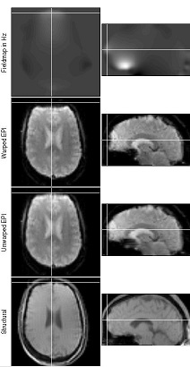
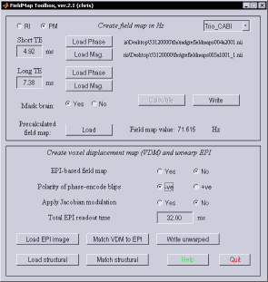
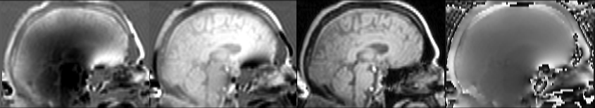

# Fieldmaps

In order to observe brain activity, we need to collect rapidly acquire images of the brain. Echo Planar Imaging (EPI) is the most popular technique for rapid MRI acquisition. However, EPI images often exhibit substantial signal dropout and spatial distortion in regions where the magnetic field is inhomogenous (for the brain, this means the fontal cortex and medial temporal lobe). We can not recover the lost signal, but we can attempt to undistort our images if we collect field maps (that measure the field inhomogeneity). These field maps take about a minute to acquire, and have the same positioning and image dimensions as our fMRI data. Undistortion can be accomplished with FUGUE (FSL) or the Fieldmap Toolbox (SPM). Both expect your data to be in NIfTI format, so if your images are in DICOM format, you will need to convert them (e.g. use [dcm2nii](https://github.com/rordenlab/dcm2niix) or SPM’s conversion functions).

There are two reasons that reduced distortion may be important for fMRI studies. First, for any fMRI study, undistortion will make the shape of a each individual’s fMRI data more similar to their anatomical scan – this improves the quality of the normalization leading to improved group level statistics throughout the brain (see Cusack & Papadakis, 2002). Second, EPI unwarping is often helpful in studies where we want to examine brain regions known to have severe homogeneity issues (frontal pole, orbito-frontal cortex, medial temporal lobe \[esp hippocampus\]). If your goal is the second, you should really attempt to tune your protocol to reduce artifacts prior to collecting any data. The reason for this is that homogeneity errors cause both signal loss and spatial distortion. Fieldmaps only help correct the shape of your EPI image, and do not recover missing signal. Also, the field maps are pretty smooth, and often do not accurately model the sharp inhomogeneities at the edge of the brain. In general, undistortion will have a minimal benefit for scans acquired on modern MRI scanners with highly optimizing shimming methods (e.g. a Siemens Trio), but may be helpful for boutique or high field applications.

The sample EPI data on this web page actually was intentionally designed to have relatively low spatial distortion at the cost of signal to noise. Specifically, the following techniques were all used to reduce spatial distortion and signal loss:

 - fast readout (parallel imaging GRAPPA x2). For systems without parallel imaging, you could consider partial Fourier.
 - short TE (27ms)
 - high bandwidth (2694 Hz/pz)
 - thin slices (2.5mm, 20% gap).

An additional reason for minimal distortion (though without a cost in signal) is that the images were acquired on a scanner with very sophisticated shimming algorithms (Siemens Trio). You should consider similar measures if you are interested in susceptible regions. If you use more traditional techniques, you will see more spatial distortion and the fieldmap correction will be more substantial.

## Using SPM’s Fieldmap Toolbox

This tutorial describes how to use the [Fieldmap Toolbox](https://www.fil.ion.ucl.ac.uk/spm/toolbox/fieldmap/) (created by Jesper Andersson and Chloe Hutton) that is included with SPM. For this tutorial, we will need to have the following files:

 - EPI data we want to undistort (typically a series of T2\*-weighted fMRI images). In the example these are the images fmris007a001_01..03. You will need to know the ‘Total EPI readout time’ for your EPI data. For Siemens scanners, you can determine this by opening up the protocol with the Exam Explorer and checking the “Echo Spacing” in the “Sequence” tab. For example, this EPI image has 64 lines, with an 0.46ms echo spacing, so one would expect the total readout time is 29.44ms. However, you need to be careful when using acceleration techniques such as partial k-space or parallel imaging. In our case, we are using parallel imaging (GRAPPA) with an acceleration factor of two, so the gradients are only collecting 32 lines, and therefore our readout time is **14.72ms** (one of the main reasons why there is relatively little distortion in these scans).
 - A Fieldmap. Fieldmaps are generated by acquiring a gradient echo image with two echoes, in our example at 4.92 and 7.38ms after excitation. A phase map shows the difference in phase between these two echoes. In our example, we have two magnitude images grefieldmaps003a1001_1.nii and grefieldmaps003a1001_1.nii (for the 4.92 and 7.38ms echo) and a phase map (grefieldmaps004a2001.nii). If you are unsure which image is the phase map, you can use SPM’s ‘display’ function. You will need to know the echo times used – your DICOM data will report this at element:tag 0018:0081, or with Siemens check the ‘Contrast’ tab with the Exam Explorer.

Here are the steps for undistortion with SPM’s Fieldmap Toolbox.

 - Choose Toolbox/Fieldmap from SPM’s menu window.
 - Press ‘Load Phase’ and choose your phase image (‘grefieldmaps004a2001.nii’). You will be asked if you want to have this scaled to radians.
 – select Yes. A new version of the fieldmap (‘scgrefieldmaps004a2001.nii’) will be created that has an intensity range of -pi..+pi (Siemens data is initially in the range -4096..+4096).
 - Press ‘Load Mag.’ and select one of your magnitude images (‘grefieldmaps003a1001_1.nii’)
 - Make sure to set your ‘Short TE’ and ‘Long TE’ to the correct values – 4.92 and 7.38 in our example (alternately, if you have placed the ‘pm_defaults_Trio_CABI.m’ in the SPM’s toolbox/FieldMap folder, you can select ‘Trio_CABI’ from the defaults pull-down menu to set these values).
 - You can check your other defaults. We tend to mask the brain.
 - Press ‘Calculate’
 – after a couple minutes a fieldmap is displayed. You can interactively click on the diplay and the amount of inhomogeneity for that voxel will appear in the ‘Field map value Hz’ field. Several new image files are created, including a voxel displacement image (VDM).
 - Press ‘Load EPI image’ and select your functional data (e.g. fmris007a001_01.nii), and make sure the Total EPI readout time is set correctly (14.72ms in our example).
 - Press ‘Load structural’ and select one of your magnitude images (‘grefieldmaps003a1001_1.nii’)
 - Press ‘Write unwarped’
 – a new undistorted image is created (ufmris007a001_01.nii).
 - The image on the right shows the SPM graphics window at this stage
 – the ‘Unwarped EPI’ should have a more similar shape to the ‘Structural’ then the ‘Warped EPI’. If the error is worse, change -ve to +ve.
 - You can now preprocess your MRI data. At this stage you will want to do your motion correction using the ‘realign and unwarp’ option, selecting the vdm file you selected here.

## Alternatives

The method described above uses SPM's fieldmap toolbox. One can accomplish similar goals using [FSL's FUGUE](https://fsl.fmrib.ox.ac.uk/fsl/fslwiki/FUGUE) . Both the FieldMap toolbox and FUGUE require you to acquire a fieldmap on your scanner. However you can also correct for spatial distortions seen in fMRI using [FSL's TOPUP](https://fsl.fmrib.ox.ac.uk/fsl/fslwiki/topup) . The basic idea with TOPUP is that you acquire two sets of scans where the phase-encoding direction is reversed between sets. This leads to images with disortion of identical magnitude but opposite direction. [TOPUP](https://fsl.fmrib.ox.ac.uk/fsl/fslwiki/topup) is able to use these images to compute a non-linear undsitortion. There is one wrinkle with regards to fMRI: TOPUP is typically employed in DTI sequences use spin-echo sequences, yet fMRI typically uses gradient echo scans. With spin echo scans the signal is moved (bunched-up in some regions pulled apart in others) whereas inhomogenous areas of gradient echo scans exhibit both spatial distortion and signal dropout. This makes it challenging to directly compute the spatial distortion using only GE images. To solve this, you would acquire your typical GE fMRI data, and next acquire a few SE volumes with identical parameters and positioning, finally you acquire a third set with a few SE volumes with identical parameters except reverse phase encoding. You use TOPUP to compute the coefficients for the SE images and than apply these (using applytopup) to the fMRI data.

## Tips

Note that tools like FUGUE expect you to provide the magnitude and phase images. If you are setting up your acquisition, you should request these images on the scanner console. However, if you are dealing with archival data, you should be able to recognize and convert different forms of images. For example, consider the [ADNI](https://adni.loni.usc.edu/data-samples/data-types/mri/) participant 130_S_4405 who was scanned in 2012 and again in 2017. The 2012 sequence only saved the image as imaginary (image below, 1st column) and real (2nd column) components of the complex image. In this case, you can use the FSL tool [fslcomplex](https://fsl.fmrib.ox.ac.uk/fsl/fslwiki/Fslutils) to create the magnitude (3rd column) and phase image (right column).

## Notes

The [Fieldmap Toolbox](https://www.fil.ion.ucl.ac.uk/spm/toolbox/fieldmap/) web page is a great source of information. Also, note that the toolbox has a ‘help’ button which displays a useful manual.

By default, when the toolbox converts an image to radians it attempts to scale the minimum intensity to -pi and the maximum to +pi. This is usually pretty accurate, but often has small errors when the phase map does not have extreme values. If you have Siemens data (where scaled values -4096..+4096 denote -pi..+pi), you can edit your Fieldmap.m file to get the precise conversion. The sample dataset includes the code you would need to insert.

## References

 - Jezzard P & Balaban RS. 1995. Correction for geometric distortion in echo planar images from Bo field variations. MRM 34:65-73.
 - Hutton C et al. 2002. Image Distortion Correction in fMRI: A Quantitative Evaluation, NeuroImage 16:217-240. 
 - Cusack R & Papadakis N. 2002. New robust 3-D phase unwrapping algorithms: Application to magnetic field mapping and undistorting echoplanar images. NeuroImage 16:754-764. 
 - Jenkinson M. 2003. Fast, automated, N-dimensional phase-unwrapping algorithm. MRM 49:193-197.

## Useful links

 - [SPM FieldMap Toolbox web page](https://www.fil.ion.ucl.ac.uk/spm/toolbox/fieldmap/) and [Example datasets](https://www.fil.ion.ucl.ac.uk/spm/data/fieldmap/). 