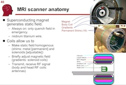

# Image to Inference (PSYC589/88 CRN529948/48893)

### Details:

 - Course Title: “Neuroimaging: from image to inference”.
 - Instructor: Chris Rorden : Office 227 Discovery I (guest lecturers from John Absher, Roger Newman-Norlund, Alex Teghipco and Natalie Hetherington)
 - Course Code: (Undergrad, CRN 19184) PSYC 589(Grad, CRN 12488) PSYC 888,3 credits. In addition, scientists are free to audit this course. Suitable for faculty, post-docs, PhD students and advanced undergraduate students.
 - When: Spring 2025 T/Th 10:05-11:20 AM, Aug 18-Dec 1
 - Where: Discovery 259
 - Formal [Syllabus](https://docs.google.com/document/d/1Wd2daWbyBJ_0i-MLrjuw1ZMZIAg8IcfU/edit?usp=sharing&ouid=101539764775409240375&rtpof=true&sd=true)
 - Course slides: [Google Slides format](https://docs.google.com/presentation/d/1Gmc3N7skPQ-nreiVxirtPIsniR4H-l0ERyTn2Ps9qRQ/edit?usp=sharing)
 - License: [the slides and material for this course are distributed under the Creative Commons license](https://creativecommons.org/licenses/by/3.0/) . Further details are in the notes section of the PowerPoint file.
- Textbook: [Functional Magnetic Resonance Imaging by Huettel, Song, and McCarthy](https://www.amazon.com/Functional-Magnetic-Resonance-Imaging-Second/dp/0878932860/).
- Supplemental textbook: [Poldrack et al.](https://www.amazon.com/Handbook-Functional-MRI-Data-Analysis/dp/0521517664/ref=sr_1_1?ie=UTF8&amp;qid=1345812543&amp;sr=8-1&amp;keywords=poldrack"/).

### Description:

Functional magnetic resonance imaging is a recent and powerful tool for inferring brain function. This technique identifies brain regions that are activated by different tasks – for example we can find the brain regions that activate when someone sees a familiar face. This course is designed to give students an understanding of the potential and limitations of this technique, and the ability to critically evaluate the inferences that can be drawn from fMRI. The course describes all stages of an fMRI study – from the design of the behavioral task (e.g. asking the participant to view faces), to the image processing (e.g. correcting images for head movements that occurred during scanning), through to statistical analysis (identifying brain regions that are activated by a task).

### Lectures

- Overview.
 - The classroom is a computer lab, so all assignments can be completed using your computer. Computation is supported by [NSF ACCESS (SOC250003)](https://support.access-ci.org/) using the Indiana Jetstream2 supercomputer and [neurodesk](https://github.com/NeuroDesk). 
- MRI physics: Image Acquisition.
 - [Terrific videos](https://magritek.com/resources/videos/) (from a company that makes a unique instructional MRI system
- MRI physics: Image Contrast.
 - Echo time and repetition time influence [T1 (recovery) and T (dephasing)](https://case.edu/med/neurology/NR/MRI%20Basics.htm).
- fMRI Paradigm Design.
 - My [fMRI simulator](https://github.com/neurolabusc/fMRI-Simulator) allows you to explore the hemodynamic changes induced by different tasks.
- Statistics and Thresholding.
 - [cluster extent challenges](https://andysbrainblog.blogspot.com/2014/01/how-to-avoid-common-cluster-extent.html)
- Spatial Processing I: Spatial Registration – realignment (motion correction), coregistration, normalization; Spatial interpolation – linear, spline, sinc functions
 - [Spatial Processing Demos](https://github.com/neurolabusc/spatial-processing).
- Spatial Processing Continued II: Smoothing – filters, edge detection, gaussian blur, homogeneity correction (for EPI and anatomical scans), motion related intensity changes.
 - [Undistorting fMRI EPI data using the SPM FieldMap toolbox](../fieldmaps/index.md).
- Temporal Processing
 - [Interactive filtering demo](https://github.com/neurolabusc/biquad-filter) shows how low-pass, high-pass and notch filters modulate a signal.
 - [Physiological Artifact Removal Tool](https://github.com/neurolabusc/Part) .
- FSL and SPM. Hands on demonstrations
 - [fMRI analysis](https://people.cas.sc.edu/rorden/tutorial/index.html).
 - [FSL: block design](https://people.cas.sc.edu/rorden/tutorial/html/block.html).
- Detecting subtle changes in brain structure: Voxel Based Morphometry and Diffusion Tensor Imaging.
 - [John Ashburner's VBM class (PDF)](https://www.fil.ion.ucl.ac.uk/~john/misc/VBMclass10.pdf).
 - [DTI tutorial](https://people.cas.sc.edu/rorden/tutorial/html/dti.html).
 - [Advanced DTI tutorial](../dti.index.md).
 - Brain injury and neuroimaging. Measuring blood flow and using lesion symptom mapping to understand the consequences of stroke and other neurological disorders.
 - [Arterial Spin Labeling](../asl/index.md).
 - Contrast-enhanced (Gadolinium) [Perfusion Weighted Imaging](../pwi/index.md).
 - [VLSM using my NPM software](https://people.cas.sc.edu/rorden/mricron/stats.html)
 - Brain stimulation: Transcranial Magnetic Stimulation (TMS), Transcranial Direct Current Stimulation (tDCS). Roger Newman-Norlund and Chris Rorden
- Graduate student presentations: Resting state analysis, effective and functional connectivity, independent components analysis, neural current MRI?

### Links

 - [Rik Henson’s fMRI mini-course](https://imaging.mrc-cbu.cam.ac.uk/imaging/SpmMiniCourse)
 - [FSL course](https://open.win.ox.ac.uk/pages/fslcourse/website/index.html)
 - [SPM course](https://www.fil.ion.ucl.ac.uk/spm/course/) , and the [SPM8 manual](https://www.fil.ion.ucl.ac.uk/spm/doc/manual.pdf)