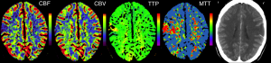
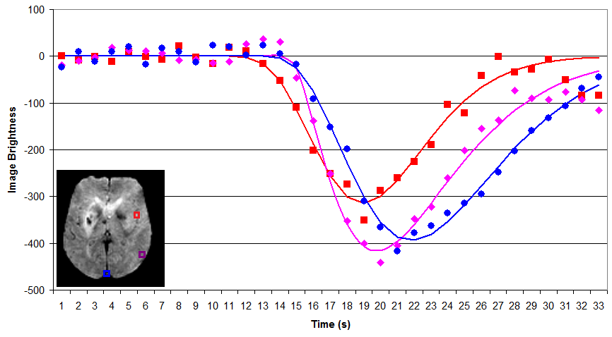

# Perfusion-weighted imaging (PWI)

Perfusion-weighted imaging (PWI) allows us to infer how blood traverses the brain’s vasculature. The most popular technique is Dynamic Susceptibility Contrast (DSC) imaging, where we inject a bolus of contrast agent (typically Gadolinium) into the vein of an individuals’ arm. This bolus is sucked into the heart, and then a large portion is pumped into the head, initially travelling through the main arteries, through the capillary beds, and finally exiting from the veins. By take a series of images, we can create a movie illustrating the speed and amount of blood reaching different portions of the brain. Specifically, Gd influences both the T1 and T2 properties of nearby hydrogen, making these regions appear darker. This is very useful for understanding acute stroke (where abnormal perfusion in regions with normal diffusion suggests salvageable tissue) and brain tumors (which exhibit unusual diffusion due to mass effects, modulated metabolism and pathological leakage across the blood-brain barrier). However, there are many different techniques for analyzing perfusion data, each with their own set of implications. This page describes some of the most popular methods, with an emphasis on my own tools. Note you can also measure blood flow using Arterial Spin Labeling (ASL), but that technique is described separately by the Arterial Spin Labeling (ASL) web page.

## Raw Data

A typical PWI sequence acquires a series of 3D volumes of the brain. For example, acquiring 53 volumes in 90 seconds of scanning. Therefore, for each slice through the brain we get a new pisture once every ~1.7s. For each individual, we typically only track the passage of a single bolus. The simplest way to analyze this data is to measure the time to peak and maximum signal reduction for each voxel by directly plotting each observation. The benefit of this technique is that it is simple and does not make any assumptions regarding the shape of bolus impulse through the scan (whereas more complicated strategies may not be as robust, see Boxerman et al., 1997; Cha et al., 2002). However, it does have a few major limitations: first the temporal resolution is limited to our sampling rate (~1.7s) and second this method is very sensitive to noise in our data (each individual sample is noisy, and we are not using information from other observations that are nearby in space and time to refine our estimate). The graph on the right shows a raw analysis of data from three voxels in the head: an input artery (red), gray matter (purple) and a vein (blue). Note that the arterial input function is early in time and creates a shorter response than the regions further upstream. DSCoMAN is a free tool that allows you to estimate raw values, as well as the ability to improve the basic linear fit with a correction for leakage described by Boxerman et al. (2006) which can be particularly well suited for tumors. Raw fitting is useful for measuring MSR, TTP and FM.

## Gamma fitting

By fitting a gamma function to our data we can attempt to minimize noise and interpolate the amplitude and timing of the bolus. As long as this function accurately models the signal change present in the data, this technique should provide a more accurate measure for parameters such as MSR, TTP and FM. For example, in the figure on the right, note that the fitted function allows us to infer that the peak times and amplitude do not precisely correspond with our observations (e.g. the peak amplitudes typically does not occur precisely at the location of the marker on the figure). Despite these advantages, both gamma functions and deconvolution (described next) are very sensitive to starting estimates noisy data, and can become trapped in local minima (poor fits of the data). My own software provides a simple tool for gamma fitting.

## Deconvolution

In the input arteries, the gamma function is a great model for the passage of the bolus, as the bolus rapidly enters and exits the region. However, in gray matter there are actually two components influencing the Gd concentration: the direct passage of the contrast agent with the blood, and the residual function of Gd being retained in the tissue. This residual function is particularly pronounced and important in brain tumors, where there is some leakage of Gd across the brain tissue. Therefore, many tools attempt to deconvolve the observed signal into the input impulse response and the residual function. Relative to raw and gamma methods, deconvolution can in theory provide purer measures for the underlying changes, provide important measures for tumors. Therefore, these tehcniques are excpetionally popular. However, this technique does require a lot more assumptions, and therefore must be used with caution. Further, recent work in acute stroke (Christensen et al., 2009) suggests that for this condition TTP and FM derived from gamma fitting are at least as good as deconvolution methods – perhaps due to a combination of the robustness of gamma fitting and the fact that TTP and FM have the benefit of being less pure measures (e.g. they combine factors that each provide predictive power). Jim is a professional tool that provides deconvolution analysis.

## A simple demonstration

I have written a very simple graphical program that lets you define a gamma variate and then see how well different methods fit the data. This uses the same algorithms as my imaging software. This program generates a signal with a specifed amount of noise, and then fits the data using raw values, an initial single-factor linear fit suggested by Madsen, and a refined nonlinear multi-factor fitting of Madsen’s formula using Powell’s Method. This program allows you to set x0 (bolus arrival time), xMax (time when bolus concentration reaches a peak), yMax (maximum height of bolus concentration), and alpha (shape of gamma function). In addition, you can choose to add Gaussian noise and define the sampling rate (TR). This software is available for download from the links on the bottom of the page.

## Perfx: A perfusion estimation tool

My Perfx (Perfusion Estimation) software will take a 4D NIfTI format
perfusion-weighted DSC images and estimate a few parameters.

 - [Source code](https://github.com/neurolabusc/niiTools) (Windows, Linux, macOS)

If your data is in DICOM format, you will need to convert it to NIfTI
(e.g. using
[dcm2niix](https://www.nitrc.org/plugins/mwiki/index.php/dcm2nii:MainPage)
). The technique is similar to Kim et al, though it uses both an initial
linear fit as well as a non-linear fit for the gamma function and does
not compute deconvolution. Therefore, this software is well suited for
stroke (e.g. robust estimates of the parameters suggested by Christensen
et al.) but less suited for tumors (where leakage means the gamma is not
a good fit). When you start a perfusion analysis you will want to check
a few parameters:

 - Motion correction: if selected images will be realigned to adjust for head motion – individuals often move their heads when they feel the contrast bolus injection begin. This uses MCFLIRT’s mutual information cost function, and therefore requires FSL to be installed (not available for Windows).
 - Brain extraction: This uses FSL’s BET to remove non-brain tissue, leading to a faster computation. Requires FSL to be installed (not available for Windows).
 - Slice timing correction: On many systems, the 3D image of the brain is not acquired at once, rather the images are acquired as a series of 2D slices. Consider an image with 16 slices acquired with interleaved ascending order: the slices are taken 1,3,5..15,2,4..16. Therefore, the slices show the image at different times. STC attempts to correct for this temporal bias by interpolating information from previous and subsequent volumes.
 - Spatial smooth FWHM mm: this allows you to blur the data a bit. This can give a more robust measure of signal, but does cost spatial precision. Kim et al suggest a 2.35mm FWHM.
 - Temporal smooth FWHM sec: This allows you to blur the signal in time. This can give a more robust estimation, but it will tend to influence the timing of some parameters (in particular, the arrival time may appear a little earlier). Kim et al. suggest 3.53 seconds.
 - Delete volumes: We often discard the first volume or two from a sequence, because it appears unusually bright (T1 has not yet saturated).
 - Baseline volumes: We will use the first few volumes (which occur after the delete volumes) prior to bolus arrival to estimate how much signal fluctuation we see due to random noise. This helps us determine which voxels should be analyzed (we will only examine voxels that show a substantial drop in relative to the baseline signal).
 - Final volume: End of volumes to examine. For example. if you set 1 delete volume, 6 baseline volumes and 42 as the final volume, then volume 1 will be discarded, volumes 2..7 will be used to estimate typical (unenhanced) signal variability (to compute a brain mask) and volumes 8..42 will be used for the gamma fitting.
 - Brain mask threshold (SD): We will only examine voxels where there is a significant signal drop relative to the baseline scans. For example, if this is set to 2.8, then only voxels where the minimum signal seen during the gamma fitting period is at least 2.8 Standard Deviations outside the average seen during the baseline period.
 - TR (sec): Duration per volume, e.g. if 2.3 than we will see a particular slice in the brain every 2.3 seconds.
 - TE (msec): This is the echo time. It is used to convert the raw signal (S(t)) to an estimate of tissue concentration using the formula C(t) =(1/TE)\*ln(S(t)/S0), where TE is the echo time, S(t) is the signal intensity at each timepoint during the gamma fitting period and S0 is the average baseline signal intensity).
 - Brain Mask (R^2): we will only accept voxels where the quality of the gamma fit exceeds this value. For example, if this is set to 0.5, then we will only accept voxels where the gamma fit explains at least 50% of the observed signal variability.
 - Voxels to determine arterial input: For computing TTP and FM, we need to estimate when the contrast first arrived in the brain. Usually, each single voxel is a bit noisy, so we want to average across a small population. For example, if set to 300, the arterial input function is based on the average input time for the 300 voxels that appear most likely to be major arteries.
 - Compute raw (unfitted) values: If checked, raw TTP and MSR maps will be generated.
 - Compute precise (but slow) fitted values: If checked, the initial fast Madsen linear approximation of the gamma function is followed by a precise fit using Powell’s method. This typically gives better answers but is slower.
 - Normalize: create additional images where shape is warped to match standard space (allowing analysis between indivieduals). Requires FSL to be installed (not available for Windows).

After setting these values and selecting the perfusion images you want
to process, the following images will be created:

 - rawmsr: Unfitted maximum signal reduction (only created if you selected to compute raw parameters).
 - rawttp: Unfitted Time To Peak (only created if you selected to compute raw parameters).
 - r2: R-squared showing goodness-of-fit for gamma function.
 - mask: Voxels outside the brain are set to zero, those used to estimate the arterial input are set to 2, and the rest of the parenchyma is set to 1. This allows you to examine the quality of the brain mask, and see if the arterial input selection is reasonable.
 - mtt: Fitted mean transit time.
 - fm: Fitted first moment (time from bolus arrival in arteries until mean of gamma function).
 - ttp: Fitted Time To Peak.

## Popular PWI Measures

 - Concentration time curve: the figures above show the raw data from a PWI MRI scan. However, in practice all techniques actually convert the raw signal curve to a concentration time curve using the formula C(t)= -(1/te)ln(S(t)/S(0)), where S(t) is the observed signal at time t, and S(0) was the average singal during the baseline prior to baseline, and te is the echo time (in practice, 1/te is a constant across all voxels and only impacts the scale, but the other portion of the equation makes the shape of the peak more pronounced.
 - CBF (Cerebral blood flow) How quickly is blood flowing through tissue, classically measured in units of mL/100g/min. Typically measured with deconvolution. (CBV/MTT).
 - CBV (Cerebral blood volume) Concentration of blood in a tissue, classically measured in units of mL/100g. Typically estimated with deconvolution. (Area under concentration time curve)
 - FM (First moment) time when half the signal change has been observed (mean) as measured by a gamma function. This has proved useful in acute stroke (Christensen et al., 2009), is intriniscally highly correlated with TTP and is analogous to MTT.
 - K2 is measured using the linear fitting method described by Boxerman et al. (2006) and correlates with leakage from the blood-brain barrier. It is particularly useful for tumours.
 - MSR (Maximum signal reduction) measures normalized drop in signal at peak relative to the baseline period prior to arrival of contrast (e.g. a measure of peak height). This appears to correlate with CBF (Klose et al., 1999).
 - MTT (Mean transit time) Similar to gamma first moment, for deconvolution methods this is based on CBV/CBF.
 - TTP (Time-to-peak) time from first appearance of bolus in artery to peak signal change observed in tissue. Surprisingly, this has proved one of the most reliable measures for identifying abnormal tissue (Christensen et al., 2009) and predicting abnormal behavior (Hillis et al., 2001) in acute stroke.
 - Rsquare ( [Coefficient of Determination](https://en.wikipedia.org/wiki/Coefficient_of_determination) ) describes how well the model describes the observed data, and ranges from 0 to 1, e.g. an Rsquare of 0.75 suggest that the model predicts 75% of the observed variance.

## Links

 - [DSCoMAN](https://sites.duke.edu/dblab/dscoman/) is a free tool for raw or Boxerman et al. corrected linear-fitted perfusion parameters. This software works as a plugin to the free ImageJ program.
 - [Perfusion Mismatch Analyzer (PMA)](http://asist.umin.jp/index-e.htm) is a free tool from Japan’s Acute Stroke Imaging Standardization Group.
 - [Jim](https://www.xinapse.com/Manual/perfusion_algorithms.html) is a professional tool that uses deconvolution methods (Ostergaard et al.). This tool has a lot of clever features that provide a lot of utility.
 - [Wikipedia](https://en.wikipedia.org/wiki/Gamma_distribution) has a great page describing the gamma probability function. This function is related to the gamma fitting used in PWI (however, the Gamma PDF has two parameters and unit area, whereas for PWI we include one parameter that describes delay and a second to describe amplitude).
 - My software attempts to find the best gamma function to fit the observed data by adjusting four values: input time, peak time, peak amplitude and shape. However, like many equations, these parameters interact, making it challenging to find the optimal combination of parameters. This is a great application for Powell’s Method, which has many other applications in neuroimaging (e.g. spatial coregistration/normalization; computing optimal hemodynamic response, etc).

## References

 - Boxerman JL, Rosen BR, Weisskoff RM. (1997) Signal-to-noise analysis of cerebral blood volume maps from dynamic NMR imaging studies. J Magn Reson Imaging. 7:528-37.
 - Boxerman et al. (2006) Relative cerebral blood volume maps corrected for contrast agent extravasation significantly correlate with glioma tumor grade, whereas uncorrected maps do not. Am J Neuroradiol. 27:859-67. deals with the problem that blood often leaks across the blood-brain barrier near brain tumours, disrupting classic linear-fitting of data. DSCoMAN includes this correction.
 - Cha S, Knopp EA, Johnson G, Wetzel SG, Litt AW, Zagzag D. (2002) Intracranial mass lesions: dynamic contrast-enhanced susceptibility-weighted echo-planar perfusion MR imaging. Radiology. 223:11-29.
 - Christensen et al. (2009) Comparison of 10 perfusion MRI parameters. Stroke 40:2055-61. compare 10 popular perfusion parameters and suggest that the time-to-peak and first-moment parameters derived by Gamma variate fitting were among the top predictors to predict infarction, numerically outperforming more complicated (though perhaps purer) deconvolution techniques.
 - Galinovic et al. (2011) Fully automated postprocessing carries a risk of substantial overestimation of perfusion deficits in acute stroke magnetic resonance imaging. Cerebrovasc Dis. 31:408-13. This manuscript compares three popular tools (StrokeTool, PMA, Perfscape) in analyzing data from 39 indviduals who did not have ischemia. The different tools provided very different measures of mean transit time, cerebral blood flow and T(max), and in many cases the automated measures appeared abnormal. This suggests that only a single method should be used for all datasets in a study, care should be taken when using these measures, and that there is clear room for improvement in these measures.
 - Hillis et al. (2001) Hypoperfusion of Wernicke’s area predicts severity of semantic deficit in acute stroke. Ann Neurol. 50:561-6.
 - Kim et al. (2010) Toward fully automated processing of dynamic susceptibility contrast perfusion MRI for acute ischemic cerebral stroke. Comput Methods Programs Biomed. 98(2):204-13. This develops a clear framework for robust, automated processing of PWI data, initially using Madsen’s linear gamma fit and then conducting deconvolution. My software uses several of the concepts from this manuscript.
 - Madsen MT (1992) A simplified formulation of the gamma variate function. Phys. Med. Biol. 37 1597-1601. The gamma function described by Thompson et al. is hard to solve, as it is hard to suggest a good starting estimate. This manuscript describes an elegant reformulation that is much easier to solve, and is used by my own and many other gamma fitting tools.
 - Ostergaard et al. (1996) High resolution measurement of cerebral blood flow using intravascular tracer bolus passages. Part II: Experimental comparison and preliminary results. Magn Reson Med.36:726-36. is the seminal work for deconvolution methods.
 - Thompson et al. (1964) Indicator Transit Time Considered as a Gamma Variate. Circ Res. 14:502-15.
