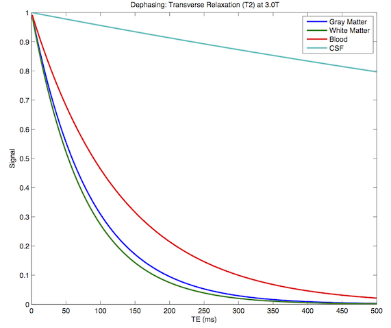

# spmScripts

Statistical Parametric Mapping (SPM) comes with a nice user interface, but sometimes small Matlab scripts can help answer your research question. A quick search of the web is usually able to find someone else who has encountered the same problem and written a Matlab script. Here are some useful links for SPM scripting.

 - [Wiki introduction to SPM scripting](https://en.wikibooks.org/wiki/SPM/Programming_intro)
 - John Ashburner’s Gems for [SPM](https://blog.nisox.org/tag/johns-gems/)
 - Chris Rorden’s spmScripts on [GitHub](https://github.com/rordenlab/spmScripts).
