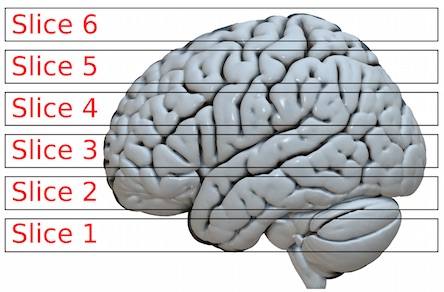
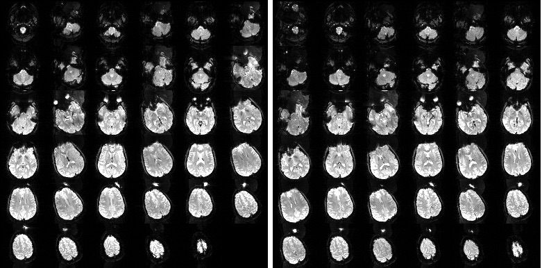
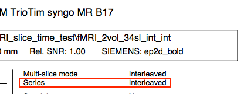

# Slice Time Correction (STC)

Modern functional magnetic imaging uses echo (or spiral) planar imaging where a 3D volume is built up from a series of 2D slices. Each slice take some time to acquire, so different slices in a 3D stack were actually observed at different time points. On the other hand, our statistics assumes that the 3D volume was acquired at the same moment in time. Therefore, it is common to slice time correct (STC). This page describes how to compute STC and describes special caveats for Siemens scanners as well as with SPM8’s STC function.

Slice Time Correction (STC) generally improves our the statistical power of fMRI analyses. In particular it is probably a good idea for event-related designs (and less useful for block designs). The irony is that Slice Time Correction (STC) is most important yet least effective when the speed of acquisition is slower. For example, consider an ascending continuous acquisition with a TR (repeat time, time between volumes) of 3000ms. In this case the middle slice is observed almost 1.5s after the first slice, and the final slice almost 3s later. If our TR was 1000ms the error would be 1/3 this size. STC works by interpolating between images (either directly or via Fourier transforms). If we want to see what a slice looks like at an earlier unobserved time, we simply estimate based on the observations we acquired immediately prior to and after the desired time. A nice analogy is estimating the temperature at 9am: we can be more accurate if our closest observations were at 8:55am and 9:05am rather than at 8am and 10am.

## Slice order

The cartoon on the depicts a volume where we acquire four 2D slices for each 3D volume of the brain. For the traditional echo-planar-imaging (EPI) we acquire each of these slices sequentially (for multi-band we can acquire a few spatially distant slices simultaneously). Therefore, with traditional EPI we do not see the whole brain at the same instance, but see different portions at different times. One can consider several slice orderings to acquire this image:

- Sequential Ascending 1,2,3,4,5,6
- Sequential Descending 6,5,4,3,2,1
- Interleaved Ascending 1,3,5,2,4,6
- Interleaved Descending 6,4,2,5,3,1
- Interleaved Ascending \* 2,4,6,1,3,5
- Interleaved Descending \* 5,3,1,6,4,2

In other words, with typical interleaved ascending we acquire the odd numbered slices first followed by the even numbered slices. Note that the slice orders number 5 and 6 (marked with a \*) are weird. While other manufacturers use only slice ordering types 3 and 4, for some odd reason Siemens Product sequences use order 3 when you acquire interleaved with an odd number of slices and order 5 when you acquire with an even number of slices. This is described in Joachim Graessner's [Slice Order (Slice Timing) for fMRI Evaluation](https://www.magnetomworld.siemens-healthineers.com/clinical-corner/application-tips/slice-order-fmri.html).However, as described below, those using the [terrific CMRR sequences](https://www.cmrr.umn.edu/multiband/) on Siemens, be aware that the manual states 'that slice excitation always starts with slice0 (the first slice) in CMRR multiband C2P sequences'. The section below describes how to test your own sequence to ensure slice order.

Most MRI scanners let you set your desired slice order. Interleaved acquisitions can have less slice interference but can show [spin history effects](https://imaging.mrc-cbu.cam.ac.uk/imaging/CommonArtefacts) if a participant moves. This is the reason most fMRI data has a ~20% gap between slices, as it reduces both interference and motion-related spin history artifacts (at the cost of less signal).

## Siemens specific details

The image on the right shows two fMRI volumes from a Siemens scanner using an ascending interleaved sequence. The only difference between the two sequences is that one volume (left) has 35 slices and the other (right) has 36 slices. In both scans the participant started with their head aligned with the scanner bore and then rotated their head half way through the acquisition. Note that the acquisition pattern is different: the head motion appears on the even numbered slices for the 35 slice volume (odd-first “Interleaved Ascending” pattern) and on the odd numbered slices for 36 volume slices (even first “Interleaved Ascending \*” pattern). As far as I know, all Siemens sequences use the standard (odd first) interleaving sequence for volumes with odd numbers of slices and the alternative (even first, \*) pattern when acquiring an even number of slices. However, you may want to test this for yourself on your system.

You have a couple options to determine the slice order you can either look at your scanner console, look at the “Series” in your protocol PDF files (shown in red in the image on the right – ignore the “multi-slice mode”), or use software that detects this for you when converting your DICOM files for subsequent processing (for example, dcm2nii since 2014 do this for Siemens images).

Another question regards what direction ‘ascending’ and ‘descending’ refer to. For axial slices it seems obvious that ascending refers to acquisitions that begin near the feet and move toward the head. But what does ‘ascending’ versus ‘descending’ refer to for sagittal and coronal sequences? One way to discover this is to look at the PDFs that you can create for your sequence. As shown in the image on the right, ascending for sagittal scans refers to right-to-left (R&gt;&gt;L), for coronal sequences ascending is anterior-to-posterior (A&gt;&gt;P) and for transverse (axial) slices the order is the expected foot-to-head (F&gt;&gt;H). This appears to be the default for Siemens MRI.

While the Siemens convention is unusual, the fact that it is consistent means that it is easy to write a script to automatically slice time correct your data. For example, if you convert your DICOM images to NIfTI format with [dcm2niix](https://github.com/rordenlab/dcm2niix) ( [included as an executable and a graphical interface with my MRIcroGL viewer](https://www.nitrc.org/projects/mricrogl/) ) you will also get a BIDS format file that reports the slice timing information. You can use the Matlab/SPM script below to correct the slice timing using this BIDS file.

## Siemens Image Numbering

The Siemens scanner allows you to reverse the image numbering, as described in the white paper below. Specifically, for axial acquisitions you can open the exam explorer and go to the 'System' tab's 'Miscellaneous' page and set the Transversal Image Numbering to H&gt;&gt;F (instead of the default F&gt;&gt;H). Doing this will flip the order images are displayed in the mosaics (with the upper left being the most superior rather than most inferior slice). There is some confusion regarding whether this option changes merely the image storage or the image acquisition. To test this, I created the examples linked at the bottom of the page. As described previously, each series started with the participant in canonical position in the scanner, but part way through each series they rotated their head so at the end of the volume the nose pointed toward one of their shoulders. As can be seen in the crucial volumes (for Siemens product, see image IM-0004-0002.dcm, for CMRR see IM-0008-0004.dcm) the Siemens Interleaved as well as Ascending volumes are still acquired in the foot-to-head direction. In other words, while changing this value saves how the images are displayed, it does not change how they are acquired. I would discourage using this setting. However, if you do have images with reversed image numbering I would recommend using dcm2niix version v1.0.20171021 or later: prior versions generate a dire warning (and do not correctly specify the slice timing field of the BIDS file).

## Setting the reference slice

Slice timing correction attempts to make all the slices in a volume appear as if they were acquired at the same moment. This allows us to apply a single statistical estimate for the whole volume. By default, SPM's slice timing will make all slices appear at the same time as the middle slice of the volume, the notion is that we want to apply the least interpolation to the center slices, which are typically our focus of interest. However, you could also align all slices to the first (or last) slice, just make sure you set your onset times accordingly.

## TR versus TA

Typically, we acquire fMRI data continuously with no gaps between volumes. Therefore, the acquisition time (TA) is directly related to the repeat time (TR). Specifically, the TA volume with N slices is TR-(TR/N). In other words, if we have a volume with 4 slices and a TR of 2000ms, the TA is 1500ms (with slices acquired at 0, 500, 1000, 1500ms). However, note that it is possible to set a temporal gap between volumes (we do this for sparse designs). Therefore, you should check this prior to STC.

## Links

 - The [practiCal page](https://practicalfmri.blogspot.com/2012/07/siemens-slice-ordering.html) has a nice description of slice timing.
 - [Paper](https://www.ncbi.nlm.nih.gov/pmc/articles/PMC3167249/) demonstrating how slice timing can help.
 - Siemens includes a [white paper](https://www.magnetomworld.siemens-healthineers.com/clinical-corner/application-tips/slice-order-fmri.html) describing slice order.
 - There is a nice [wiki page](https://en.wikibooks.org/w/index.php?title=SPM/Slice_Timing#Slice_Order) on slice order.
